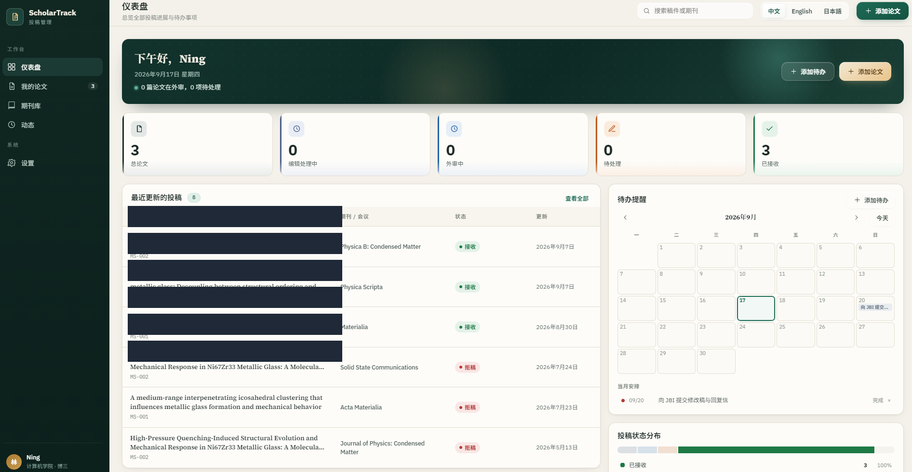
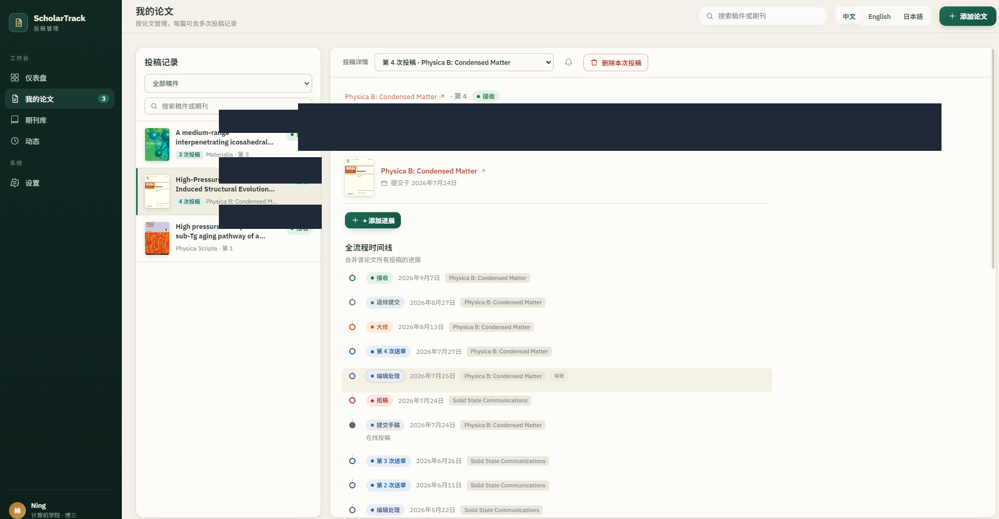
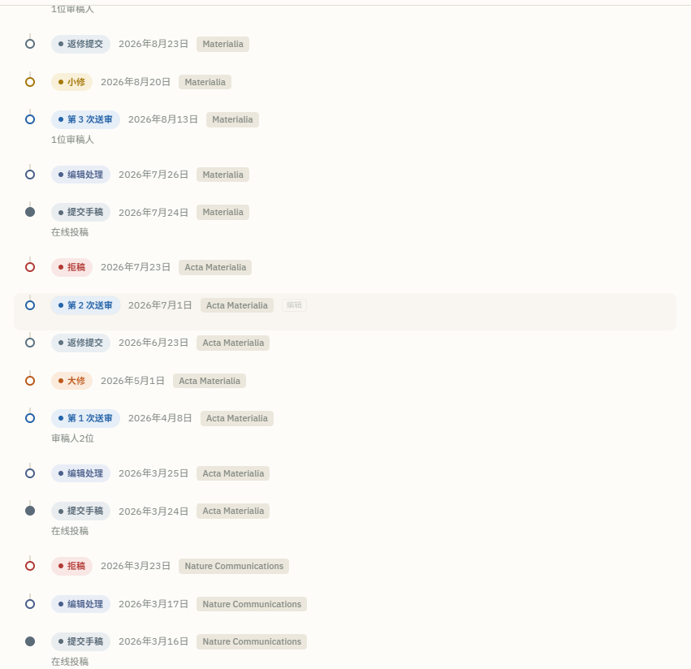
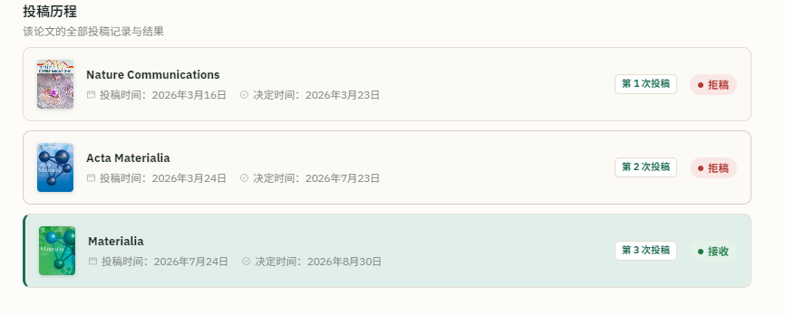
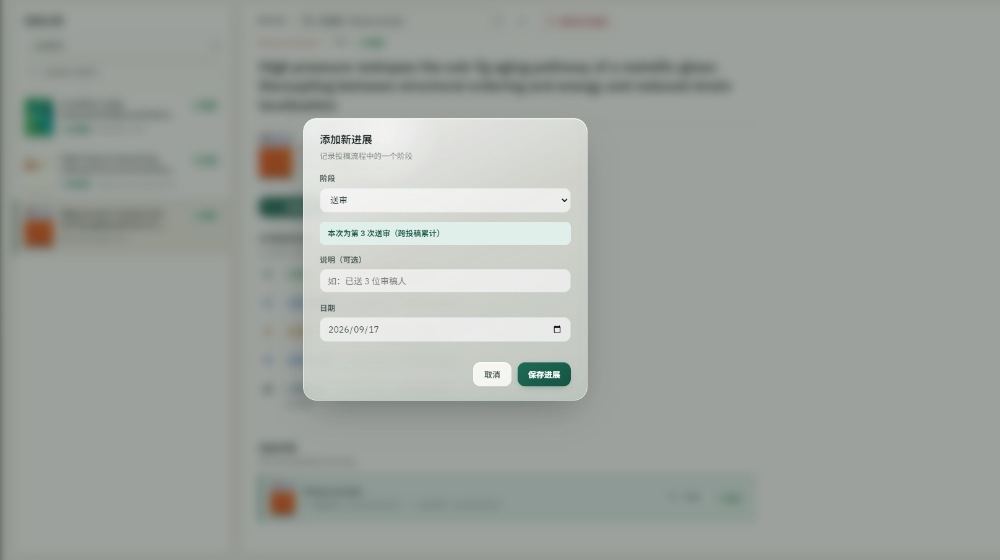
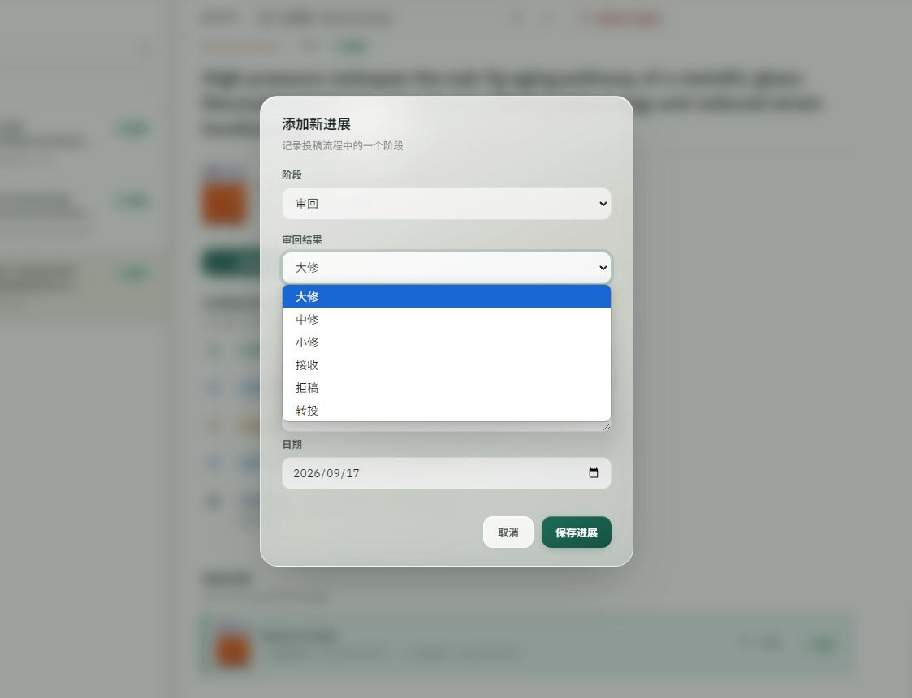
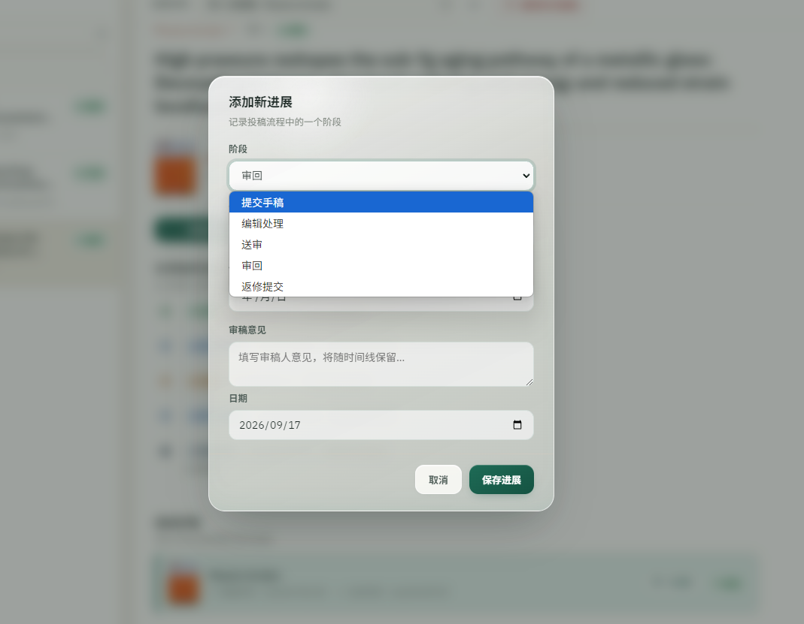
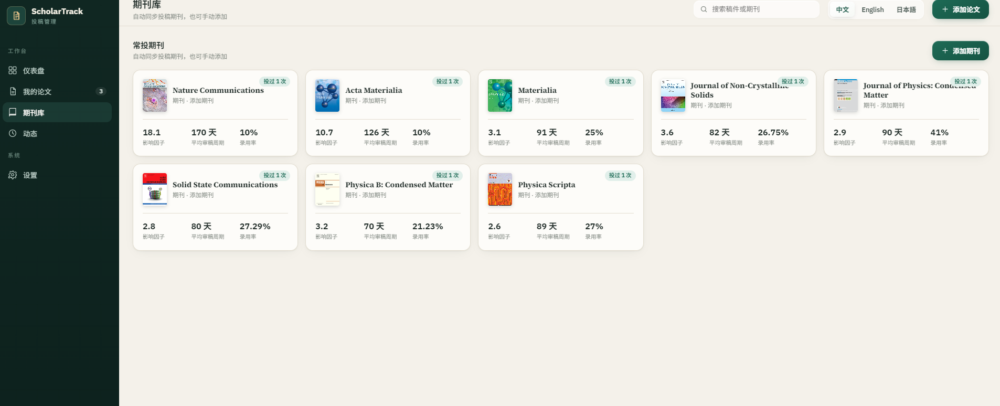
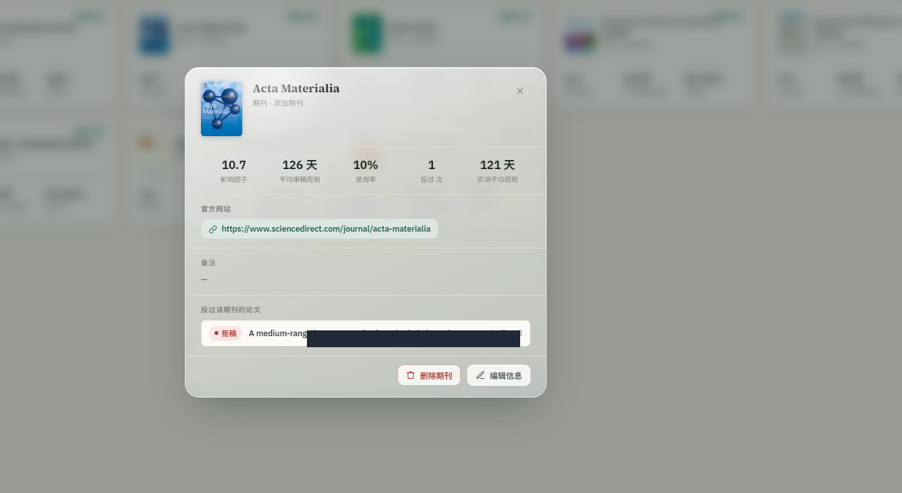
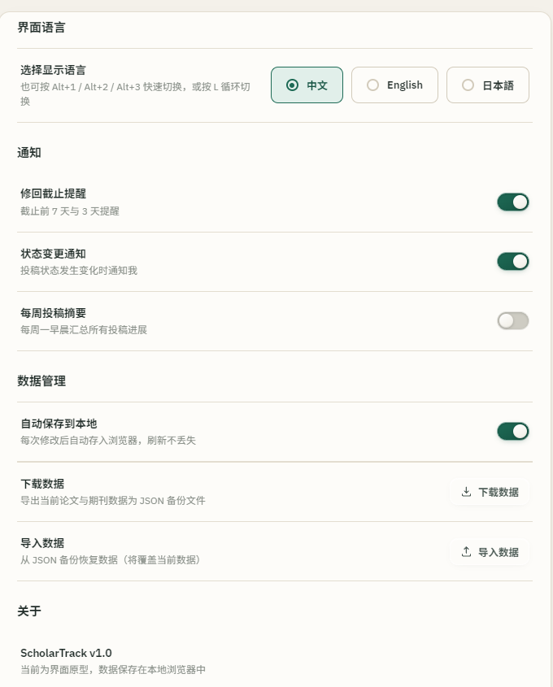

# ScholarTrack · 学术论文投稿状态管理

> 面向科研人的论文投稿全流程管理工具。一次记录，全流程跟踪——从提交、送审、审回，到拒稿转投、返修、录用。

[中文](#) · [English](#english) · [日本語](#)

---

## 为什么需要它

投稿过程分散在邮箱、期刊系统、Excel 里，状态一变就要来回翻。ScholarTrack 把每一篇论文的**全部投稿历程**收进一个界面：

- 拒稿 → 转投，仍是**同一篇论文**，时间线叠加跟踪，不新建条目、不产生冗余
- 每次送审记录**第 N 次**，审回意见随手存进时间线
- 期刊库从投稿**自动同步**（封面、影响因子、审稿周期、录用率），下次直接选
- 修回截止日自动进日历，重要事项标红提醒

## 功能特性

| 模块 | 说明 |
|---|---|
| 仪表盘 | 统计卡（总论文/编辑处理中/外审中/待处理/已接收）、状态分布、最近更新、日历待办 |
| 我的论文 | 参考图式 master-detail 布局；时间线节点可点击编辑；投稿历程时间轴 |
| 期刊库 | 手动添加 + 投稿自动同步；封面、官网直达、投过论文互跳、实测平均审稿周期 |
| 动态 | 全部投稿操作的时间线聚合 |
| 三语界面 | 中文 / English / 日本語，Alt+1/2/3 或 L 快速切换 |
| 数据安全 | 本地 JSON 文件存储，**原子写入 + 自动滚动备份**，导出/导入一键备份 |

### 投稿流程模型

提交手稿 → 编辑处理 → 送审（第 N 次）→ 审回（大修 / 中修 / 小修 / 接收 / 拒稿 / 转投，可附审稿意见与截止日期）→ 返修提交

## 界面预览

### 仪表盘 — 一屏总览



统计卡片、最近更新投稿、待办日历、投稿状态分布，打开即见全局。

### 我的论文 — 全流程时间线



按论文归档，每篇可含多次投稿记录；右侧时间线合并展示从首次投稿到最终接收的完整轨迹。



每一个节点都标注日期与期刊：拒稿 → 转投 → 送审 → 审回 → 返修 → 接收，一目了然。



每次投稿的期刊、投稿时间、决定时间、结果以卡片形式并排展示。

### 投稿与进展记录

| 添加新进展 | 添加新投稿 |
|---|---|
|  |  |

支持送审、审回（大修/中修/小修/接收/拒稿/转投）、返修提交等阶段，可附审稿意见与截止日期。

| 审回结果选择 | 阶段选择 |
|---|---|
|  |  |

### 期刊库 — 数据驱动选刊





每本期刊记录影响因子、平均审稿周期、录用率，以及你自己投过这本刊的实际审稿时长。

### 设置与提醒



修回截止提醒、状态变更通知、每周投稿摘要；数据自动保存，JSON 一键导出/导入。

---

## 快速开始

### 桌面版（Windows，推荐）

1. 下载 `dist/ScholarTrack-1.0.0-portable.exe`（免安装单文件）
2. 双击运行，数据自动保存在 `%APPDATA%\ScholarTrack\data.json`

### 浏览器版

直接打开 `index.html` 即可（数据存浏览器 localStorage，仅作演示）。

### 自行打包

```bash
npm install
python make_icon.py   # 生成 build/icon.ico（首次）
npm run dist          # 输出到 dist/，生成 portable 单文件 EXE
```

> 国内网络已配置 npmmirror 镜像加速（`ELECTRON_MIRROR` / `ELECTRON_BUILDER_BINARIES_MIRROR`）。

## 技术栈

- **界面**：单文件 HTML + 原生 JavaScript + 内联 CSS（无框架、无构建步骤）
- **桌面**：Electron 33 + electron-builder（portable 打包）
- **存储**：本地 JSON 文件，原子写入 + 滚动备份（`main.js`）
- **i18n**：内置三语词典，运行时切换

## 目录结构

```
├── index.html          # 主界面（全部 UI 与逻辑）
├── main.js             # Electron 主进程：窗口 + 文件存储
├── preload.js          # 页面 ⇄ 存储 安全桥接
├── package.json        # 打包配置
├── make_icon.py        # 图标生成脚本（纯标准库）
├── build/icon.ico      # 应用图标
└── dist/               # 打包产物（portable EXE / win-unpacked）
```

## Roadmap（可期）

- [ ] 深色模式
- [ ] 投稿状态分布图 / 趋势图
- [ ] 审稿意见富文本
- [ ] 期刊收藏置顶

## License

[MIT](./LICENSE)

---

<a name="english"></a>

## English

ScholarTrack is a submission-status tracker for academic researchers. Track the full journey of each manuscript — submissions, review rounds, decisions, resubmissions and revisions — with a journal library that syncs automatically and local-first data storage. Desktop app for Windows (Electron), single-file UI, trilingual (中文 / English / 日本語).

### Key Features

- **Paper-centric tracking** — one paper, multiple submissions. Transfer journals without losing your progress history.
- **Full timeline** — merges all submissions into one chronological trail, from first submission to final acceptance.
- **Journal library** — impact factor, average review time, acceptance rate, and your own actual review duration per journal.
- **Smart reminders** — revision deadline warnings (7 / 3 days before), status change notifications, weekly digest.
- **Trilingual UI** — Chinese / English / Japanese, switchable via `Alt+1/2/3` or `L`.
- **Local-first** — atomic JSON writes with rolling backups, one-click export/import.

### Quick Start

Download the portable EXE from `dist/` and double-click to run. No installation required.
